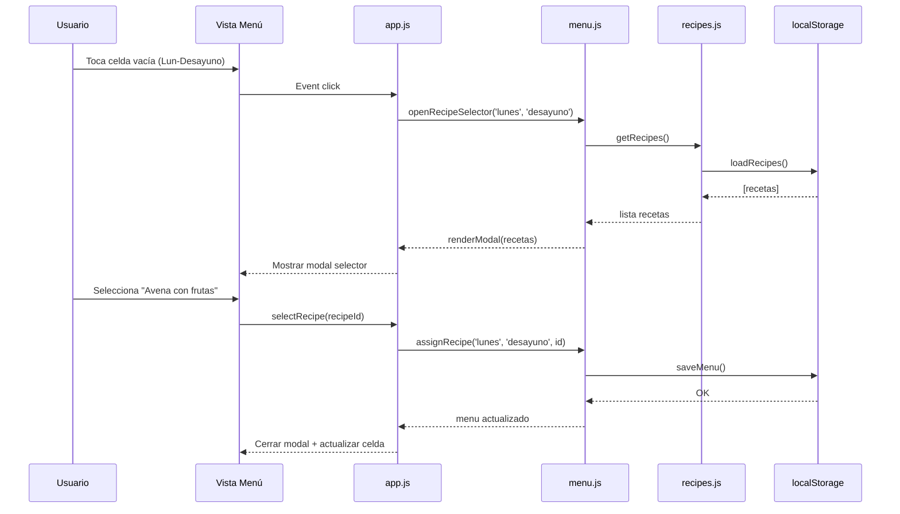
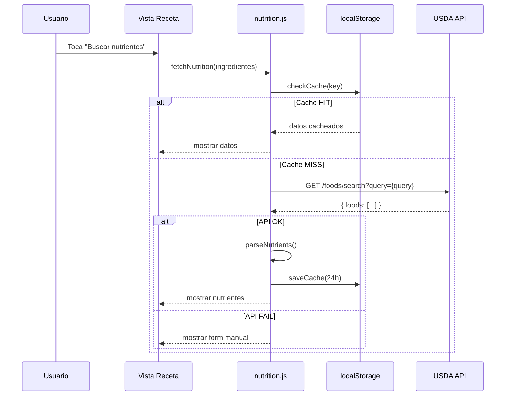

# Diseño: App Menú Semanal

> Proyecto: `app-menu-semanal/`
> Fase: Diseño (v1.0)
> Fecha: 2026-06-17

---

## Arquitectura

```
┌─────────────────────────────────────────────────────────────┐
│                        CLIENTE (SPA)                        │
├─────────────────────────────────────────────────────────────┤
│                                                             │
│  ┌─────────┐    ┌─────────┐    ┌─────────┐                 │
│  │  Vista   │    │ Vista   │    │ Vista   │                 │
│  │  Menú    │◀──▶│Recetas  │◀──▶│ Detalle  │                 │
│  └────┬─────┘    └────┬─────┘    └─────────┘                 │
│       │               │                                     │
│       ▼               ▼                                     │
│  ┌─────────────────────────────────────────┐                 │
│  │              app.js (Router)            │                 │
│  │   hash-based routing (#/menu, #/recipes)│                 │
│  └────────────────────┬───────────────────┘                 │
│                       │                                      │
│       ┌───────────────┼───────────────┐                    │
│       ▼               ▼               ▼                    │
│  ┌─────────┐    ┌─────────┐    ┌─────────────┐             │
│  │ menu.js │    │recipes.js│   │nutrition.js │             │
│  │ (state) │    │ (CRUD)   │   │  (API USDA) │             │
│  └────┬────┘    └────┬────┘    └──────┬──────┘             │
│       │              │                │                      │
│       └──────────────┼────────────────┘                    │
│                      ▼                                     │
│              ┌─────────────────┐                           │
│              │   localStorage  │                           │
│              │ recipes.json    │                           │
│              │ weekly-menu.json│                           │
│              └─────────────────┘                           │
└─────────────────────────────────────────────────────────────┘
                              │
                              ▼
              ┌───────────────────────────────┐
              │   USDA FoodData Central API   │
              │   api.nal.usda.gov/fdc/v1     │
              └───────────────────────────────┘
```

---

## Decisiones Arquitectónicas

### DA-1: SPA con Hash Routing

| Aspecto | Decisión |
|:--------|:---------|
| **Decisión** | Usar hash-based routing (`#menu`, `#recipes`, `#recipe/:id`) |
| **Justificación** | GitHub Pages no tiene servidor para rutas 404; hash routing funciona sin config |
| **Alternativas** | History API (requiere fallback 404), framework routing |

---

### DA-2: Vanilla JS sin Framework

| Aspecto | Decisión |
|:--------|:---------|
| **Decisión** | HTML + CSS + JS vanilla puro |
| **Justificación** | Simplicidad, sin build, carga rápida, fácil debugging |
| **Alternativas** | React/Vue (overkill), Alpine.js (bueno pero dependencia) |

---

### DA-3: localStorage para Persistencia

| Aspecto | Decisión |
|:--------|:---------|
| **Decisión** | localStorage + JSON files |
| **Justificación** | Sin backend, 2 usuarios domésticos, datos no críticos |
| **Alternativas** | IndexedDB (más complejo), Firebase (requiere cuenta) |

---

### DA-4: API Nutricional con Cache

| Aspecto | Decisión |
|:--------|:---------|
| **Decisión** | USDA API + cache en localStorage (24h) |
| **Justificación** | Rate limit 1000/day; cache reduce llamadas dramáticamente |
| **Alternativas** | Edamam (requiere registro), Nutritionix (pago) |

---

## Diagramas de Secuencia

### Flujo: Asignar Receta a Menú



---

### Flujo: Buscar Nutriente via API



---

## Estructura de Archivos

```
app-menu-semanal/
├── index.html              # Entry point, SPA container
├── css/
│   └── styles.css          # Mobile-first responsive styles
├── js/
│   ├── app.js              # Router + main controller
│   ├── menu.js             # Menú semanal state & logic
│   ├── recipes.js          # Recetas CRUD
│   ├── nutrition.js        # USDA API + cache
│   └── components.js       # UI components (modal, cards, etc.)
├── data/
│   ├── recipes.json        # Recetas iniciales (sample data)
│   └── translations.json   # Strings UI (español)
├── assets/
│   └── icons/              # SVG icons inline (no external deps)
├── SPEC.md                 # Este documento
├── DESIGN.md               # Este archivo
└── README.md               # Setup + deploy
```

---

## Componentes UI

### MealCell (Celda de Comida)

```
Estados:
- VACANT: celda vacía, borde punteado, "+" visible
- ASSIGNED: muestra nombre + mini kcal
- LOADING: spinner al cargar receta
- ERROR: icono warning si datos corruptos
```

### RecipeCard (Tarjeta Receta)

```
Estructura:
┌────────────────────────┐
│ 🥗 [Nombre Receta]     │
│ 350 kcal | 25P | 15G   │
│ [tags: rápida, vegana] │
└────────────────────────┘
```

### NutritionPanel

```
┌────────────────────────┐
│ 📊 Información         │
│ Nutricional (por ración)│
├────────────────────────┤
│ Calorías   ████████░░ │
│             350 kcal   │
├────────────────────────┤
│ HC        ████░░░░░░  │
│             45g        │
├────────────────────────┤
│ Proteínas  █████░░░░░ │
│             30g        │
├────────────────────────┤
│ Grasas     ███░░░░░░░ │
│             12g        │
└────────────────────────┘
```

---

## Estilos CSS (Variables)

```css
:root {
  /* Colores */
  --color-primary: #2D6A4F;      /* Verde salud */
  --color-secondary: #40916C;
  --color-accent: #95D5B2;
  --color-background: #F8F9FA;
  --color-surface: #FFFFFF;
  --color-text: #1B1B1B;
  --color-text-muted: #6C757D;
  --color-error: #DC3545;
  --color-success: #28A745;

  /* Espaciado */
  --space-xs: 4px;
  --space-sm: 8px;
  --space-md: 16px;
  --space-lg: 24px;
  --space-xl: 32px;

  /* Tipografía */
  --font-family: -apple-system, BlinkMacSystemFont, 'Segoe UI', Roboto, sans-serif;
  --font-size-xs: 12px;
  --font-size-sm: 14px;
  --font-size-md: 16px;
  --font-size-lg: 18px;
  --font-size-xl: 24px;

  /* Bordes */
  --radius-sm: 4px;
  --radius-md: 8px;
  --radius-lg: 16px;

  /* Sombras */
  --shadow-sm: 0 1px 3px rgba(0,0,0,0.12);
  --shadow-md: 0 4px 6px rgba(0,0,0,0.1);
}
```

---

## Siguiente paso

¿Aprobás el diseño? Si confirmás, avanzo a **Fase 4: Tareas** (desglose implementación).
